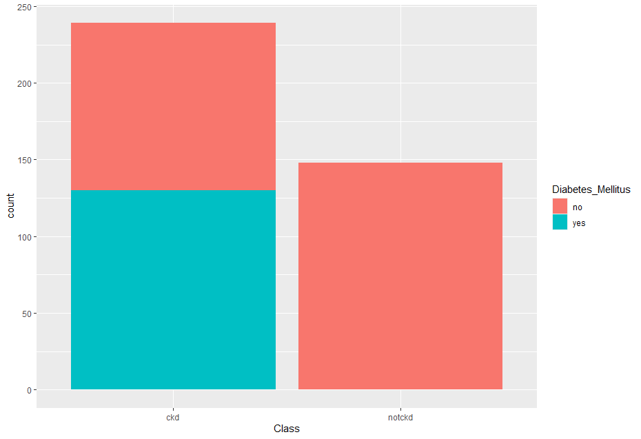
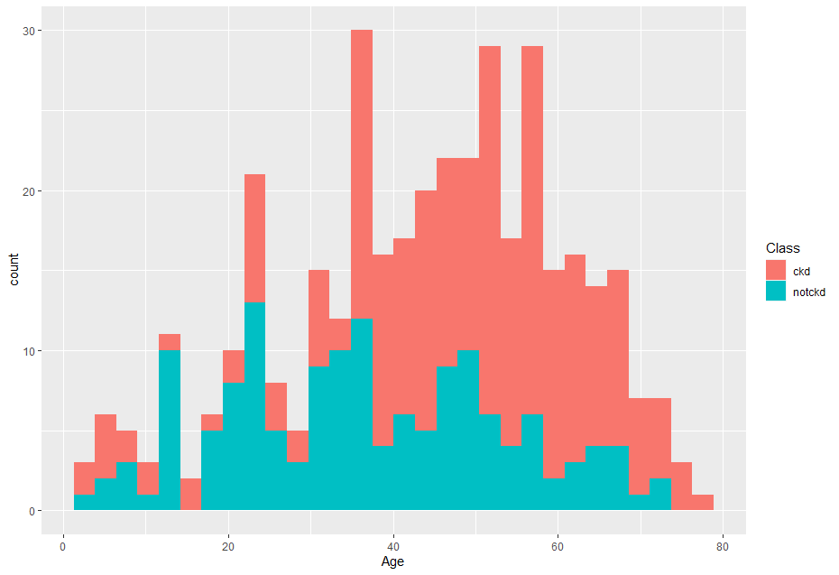
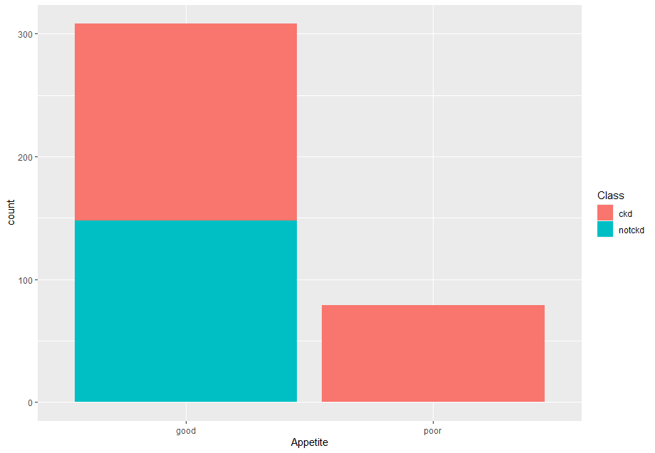
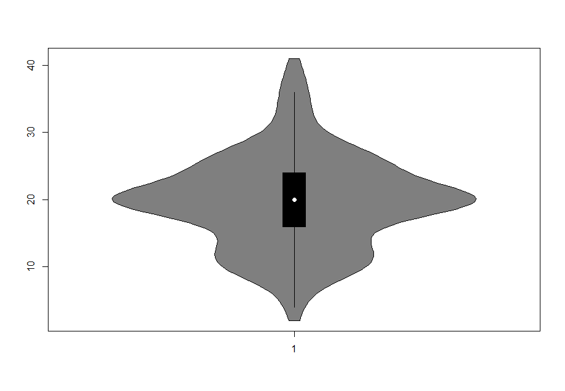
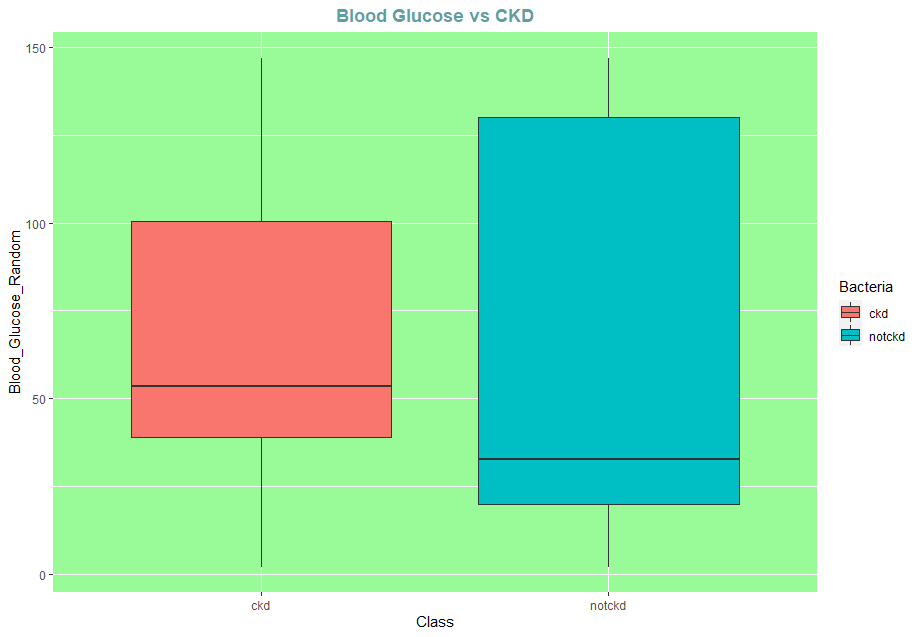

# Chronic-Kidney-Disease-Predictor
This project is implemented in R
## Work Done
* Cleaned the given data using various R's inbuilt methods
  * Encoded Categorical Variables
* Performed EDA using R's GGPLOT library
* Implemented classification based ML model 
  * Logistic Regression using R's glm method
  * Decision Tree using party package for R and ctree method
* Displayed performance metric and compared the performance between the implemented models

## Various Visualisations from the Project using R's GGPLOT Library

